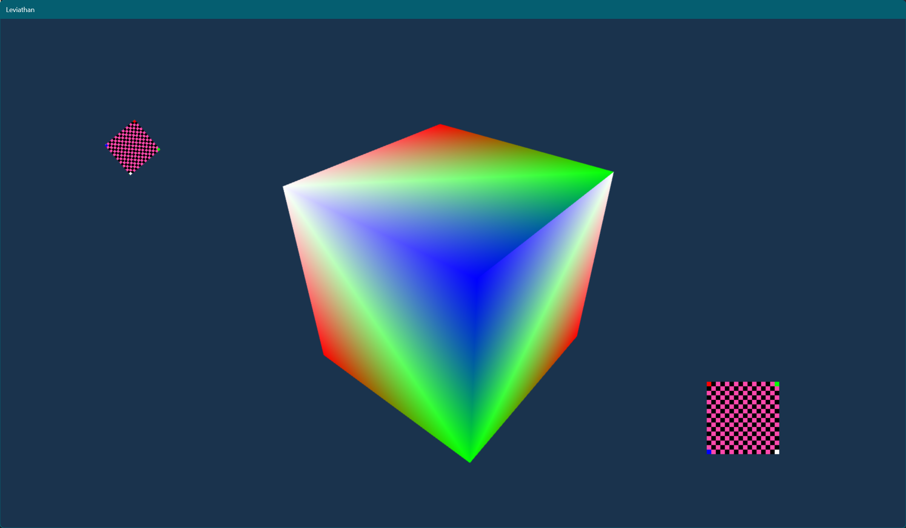

# LEVIATHAN

Leviathan is a personal megaproject of sorts that currently homes the following __EXTREMELY WIP__ projects of mine:
- Leviathan engine - A C++ Game Engine
- EtCetera/PuzzleSolver - A Sudoku Solver
- EtCetera/BitmapFile - .BMP file I/O
- Hellos - A Set of Common Boilerplates/Project Templates that I don't want to retype!
- ShaderAtoll - Goal: A Desktop ShaderToy-like app
- Untulpa - Goal: Fast duplicate file finder / organizer

#### Latest screenshots:

